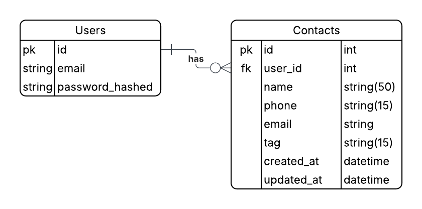

# Contact-Book

```
   ____ ___  _   _ _____  _    ____ _____   ____   ___   ___  _  __ 
  / ___/ _ \| \ | |_   _|/ \  / ___|_   _| | __ ) / _ \ / _ \| |/ /
 | |  | | | |  \| | | | / _ \| |     | |   |  _ \| | | | | | | ' / 
 | |__| |_| | |\  | | |/ ___ \ |___  | |   | |_) | |_| | |_| | . \ 
  \____\___/|_| \_| |_/_/   \_\____| |_|   |____/ \___/ \___/|_|\_\
                                                                         
TechCrush bootcamp standalone project.
```


A small Express + Sequelize project for storing user contacts (TechCrush bootcamp).

## Features
- User authentication (register / login / refresh)
- Add, list, search, update and delete contacts
- CSV backup generation and download for authenticated users (backups saved to `backups/`)
- Input validation using `express-validator`
- JWT access + refresh token flow (refresh stored in cookie)

## Quick start

### 1. Install dependencies

```bash
npm install
```

### 2. Create a `.env` file in the project root. Required variables:
- ENVIRONMENT
- PORT
- DATABASE_NAME, DATABASE_USERNAME, DATABASE_PASSWORD, DATABASE_HOST, DATABASE_PORT, DATABASE_DIALECT
- ACCESS_TOKEN_SECRET, REFRESH_TOKEN_SECRET
- ACCESS_TOKEN_EXPIRES (minutes), REFRESH_TOKEN_EXPIRES (days)
- SESSION_COOKIE_NAME

### 3. Run
```bash
npm start
```

Server runs at http://localhost:<PORT> (default 3000).

## Project structure
- src/app.js — application entry
- src/config — config and DB connection
- src/controllers — route handlers
- src/routes — route definitions
- src/validators — input validation rules
- src/middlewares — auth, validation error handler, global error handler
- src/services — business logic (contact/user services)
- src/models — Sequelize models
- src/utils/fileBackup.js — CSV backup writer used by download endpoint
- backups/ — runtime folder where CSV files are saved


## Routes (all prefixed with `/api`)
### Authentication (src/routes/auth.js)
- **POST /api/auth/register** — register new user
- **POST /api/auth/login** — login (returns access token and sets refresh cookie)
- **POST /api/auth/refresh** — refresh access token (uses refresh cookie)
- **POST /api/auth/logout** — clear refresh cookie

### Contacts (require Authorization: Bearer <access_token>)
- **POST /api/add-contact** — add contact  
  Body: `{ name, phone, email?, physicalAddr?, tag? }`
- **GET  /api/contacts** — list contacts  
  Query: `tag?`, `sortBy?`, `ord?`
- **GET  /api/search** — search contacts  
  Query: `id?`, `name?`, `phone?`
- **GET  /api/download** — generate CSV backup and download as attachment
- **PUT  /api/:id** — update contact (param id; body: updatable fields)
- **DELETE /api/:id** — delete contact

### Notes:
- All contact endpoints require a valid access token in the `Authorization: Bearer <token>` header.
- CSV backup files do not include `id` or `userId`. Fields included: `name`, `phone`, `email`, `physicalAddr`, `tag`, `createdAt`, `updatedAt`.

## Validators
Input rules live under `src/validators` and are applied via route middleware. If you see validation errors:
- Ensure `Content-Type: application/json` is set
- Send valid JSON (no comments)

## Postman / Testing
### Notes

- Auth endpoints set a refresh cookie (name from SESSION_COOKIE_NAME).
- All contact endpoints require `Authorization: Bearer <access_token>` header.
- CSV backups exclude id and userId. Fields included: `name, phone, email, physicalAddr, tag, createdAt, updatedAt`.

### Authentication
- POST `/api/auth/register`

    - Body (JSON): 
    ```json
    { 
        "username": "Test", 
        "email": "test@mail.com", 
        "password": "passwoRd@123", 
        "confirmPassword": "passwoRd@123" 
    }
    ```
    - Success: `201` 
    ```json 
    { 
        "success": true, 
        "message": "User registered"
    }
    ```
    - Errors: `400` validation errors


- POST `/api/auth/login`

    - Body (JSON): 
    ```json
    { 
        "email": "test@mail.com", 
        "password": "passwoRd@123" 
    }
    ```
    - Success: `200` returns 
    ```json
    { 
        "success": true, 
        "user": {...}, 
        "accessToken": "<jwt>" 
    } 
    ```
    and sets refreshToken cookie
    - Errors: `401` invalid credentials


- GET `/api/auth/refresh`

    - Uses refresh cookie to issue a new access token (if implemented).

- POST `/api/auth/logout`

    - Clears refresh cookie (if implemented).


### Contacts
- POST `/api/add-contact`

    - Headers: `Authorization: Bearer <token>`, Content-Type: application/json
    - Body (JSON): 
    ```json
    { 
        "name": "John Doe", 
        "phone": "08123456789", 
        "email": "example@test.com", // optional 
        "physicalAddr": "New York", // optional 
        "tag": "neighbour" // optional 
    }
    ```
    - Success: `201` 
    ```json
    { 
        "success": true, 
        "message": "Contact created successfully" 
    }
    ```
    - Validation errors: `400` with details

- GET `/api/contacts`

    - Query params (optional): `tag`, `sortBy` (e.g. date or name), `ord` (asc or desc).
    **Not using any params will return all user's contact.**
    - Success: `200` 
    ```json
    { 
        "success": true, 
        "data": [...] 
    }
    ```
- GET `/api/search`

    - Query params (optional): `id`, or `name`, or `phone`
    - Success: `200` 
    ```json
    { 
        "success": true, 
        "data": [...] 
    }
    ```
     or `404` if none found.

- GET `/api/download`

    - Generates a CSV backup of the authenticated user's contacts and returns it as an attachment.
    - Success: `200` (file attachment)

- PUT `/api/:id`

    - Headers: `Authorization: Bearer <token>`, Content-Type: application/json
    - Params: `id` (contact id)
    - Body: **any updatable fields** 
    ```json
    {
        "name": "Doe John", 
        "phone": "+2348123456789", 
        "email": "NewExample@test.com", 
        "physicalAddr": "Lagos, Nigeria",
        "tag": "friend"
    }
    ```
    - Success: `200` 
    ```json
    { 
        "success": true, 
        "message": "Contact updated" 
    }
    ``` 
    (or similar)

- DELETE `/api/:id`

    - Headers: `Authorization: Bearer <token>`
    - Params: `id` (contact id)
    - Success: `200` 
    ```json
    { 
        "success": true, 
        "message": "Contact deleted" 
    }
    ```
    (or similar)


## ER Diagram
The project's Entity-Relationship diagram is included below.  
Some changes where made after the initial design as suggested during review.:




## Postman export (raw)
A Postman collection export is provided to replicate tests. Import the JSON file into Postman:

[Postman collection export file](doc/PostMan_exported.json)  

[Postman Link](https://uche09-6754057.postman.co/workspace/uche09's-Workspace~b3a89bc7-35e1-43ec-884b-f92280b950f5/collection/48923781-0f7a30ce-a92a-4a05-af0d-4c4ad3616503?action=share&creator=48923781&active-environment=48923781-b49a6c36-10c1-424b-b712-07199db1f8e4)

## Backups
- CSV backups are created in the `backups/` directory at runtime.
- Files are named like `contacts_backup_user_<userId>_<timestamp>.csv`.
- The backup util escapes fields per RFC4180.

## Troubleshooting
- If validators report missing fields, check that your request includes `Content-Type: application/json` and a valid JSON body.
- If CSV download fails, ensure the authenticated user has contacts and the server can write to the `backups/` directory.
